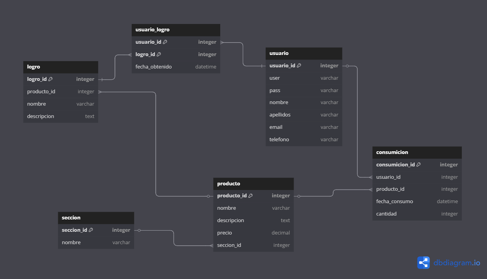

# ☕ Cafetería Web – Aplicación Completa con Node.js y Express

Esta es una página web desarrollada para una cafetería, que incluye funcionalidades completas para usuarios y administradores: pedidos con generación de PDF, reservas de mesas, calendario de eventos, contacto, sistema de login/registro y gestión de usuarios. Desarrollado con **Node.js**, **Express**, **EJS**, y otras herramientas del ecosistema web.

## 🚀 Tecnologías utilizadas

- **Node.js** con **Express.js**
- **EJS** como motor de plantillas
- **Nodemailer** para envío de correos
- **pdfkit** para generación de tickets de pedidos en PDF
- **MYSQL** para la BBDD
- **CSS personalizado** para el diseño
- **OpenStreetMap** para geolocalización
- **JavaScript** en frontend para interactividad
- **RENDER** para el despliegue
- [Visita nuestra web](https://pfg-wobp.onrender.com)

---





## 🔧 Instalación

1. Clona el repositorio:
   ```bash
   git clone https://github.com/tuusuario/cafeteria-app.git
   cd cafeteria-app
